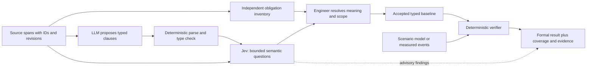

# Jev as a semantic bridge for computable systems engineering

**Research status, 2026-09-29:** This is a source-backed design assessment, not
an installed integration or a live model evaluation. No project or private
engineering material was sent to Jev. The likely intended product is TypeSafe
AI's **Jev** (named after William Stanley Jevons, not an acronym). It accepts
text or structured state plus predefined Choice, Score, or yes/no (“Noul”)
questions and returns typed answers and probabilities. It does not generate a
formal specification, run a model checker, or prove an engineering claim.
[Official introduction](https://docs.typesafe.ai/introduction),
[primitives](https://docs.typesafe.ai/primitives),
[founder announcement](https://typesafe.ai/blog/introducing-system-one-models-and-jev).

## What it changes, and what it does not

The stable part is Jev's **answer shape**: a question has a declared answer
space, and the returned value can be validated against that space. The answer
itself is a learned judgment. TypeSafe says calibration applies across groups
of predictions, not that each decision is correct. Its own 15-call
[self-consistency example](https://docs.typesafe.ai/cookbooks/consistency_noul_cookbook)
reports a borderline probability moving from 0.43 to 0.53; each call also
changed an irrelevant UID, so the study shows practical input sensitivity but
does not isolate byte-identical-request nondeterminism. The
[Jev 1.13 limitations](https://docs.typesafe.ai/model-jaggedness/jev-1.13)
explicitly identify weaknesses with numbers, time, counting, indirection,
large distracting inputs, adversarial content, and independently phrased
questions that do not obey expected logical identities. A confidence score is
derived from answer probabilities, not a correctness certificate
([confidence guide](https://docs.typesafe.ai/confidence)).

This distinction is the architectural boundary: Jev can help decide **which
candidate meaning deserves human attention**. Only a deterministic program can
decide whether an accepted, typed clause holds in a declared finite model or
supplied trace. Engineer acceptance of consequential meaning stays separate.
Typed model output must never silently become a `pass` for source coverage,
requirements satisfaction, or system performance.

| Suitable Jev question, with bounded options and source span | Program or engineer responsibility |
|---|---|
| Is this passage a requirement, goal, assumption, observation, or unclear? | Preserve every passage in an independent source inventory; decide the authoritative category. |
| Which of several *quoted* spans identifies the trigger or response, or `none`? | Extract exact spans and offsets, parse names and values, and ask the engineer to resolve consequential alternatives. |
| Does the candidate clause seem to omit a condition or invent a threshold? | Enforce syntax, declared units, exact clock conversion, coverage, and the final verdict in code. |
| Does cited evidence appear relevant to a candidate claim? | Verify exact quotation/source binding; assess acceptance and evidence quality separately. |

TypeSafe's own [pre-parsed extraction](https://docs.typesafe.ai/cookbooks/pre_parsed_value_extraction_cookbook),
[citation checking](https://docs.typesafe.ai/cookbooks/citation_check), and
[extraction cascade](https://docs.typesafe.ai/cookbooks/sde_cascade) illustrate
this narrow-judgment pattern. They are examples of architecture, not evidence
that Jev is accurate enough for this project's domain.

The Jev lane may flag ambiguity or withhold automated promotion. It cannot add,
remove, relax, or approve obligations. Failure, timeout, malformed answers, or
uncertainty leaves semantic mapping unresolved; deterministic checks can still
run on already accepted clauses. A report must label Jev's result as a
probabilistic assessment and the verifier's result as a model-bounded
computation.

For example, the FHWA source defines a one-minute response interval using
specific byte events. A drafting model could propose `within 1 minute`; Jev
could choose among quoted candidate spans for the timer start and end and flag
an omitted per-request relationship. The engineer would decide the intended
mapping. Only then would a deterministic checker compare correlated event
timestamps. Jev's probability would never substitute for that comparison.

## A broader checker with a small stable core

Jev would improve the **translation and review workflow** across larger
concepts, CONOPS, scenarios, and requirements. It would not, by itself,
broaden what the formal checker can prove. To broaden that checker, retain one
versioned typed representation and add small, separately specified semantic
modules only when a real case requires them: identified timestamped events,
per-request obligations, state-transition/order constraints, bounded
quantification, and explicit assumptions about the environment. Generate the
controlled sentence, explanation, diagram, tests, and report from the same
representation. Unsupported meanings stay visible in the review denominator.
This preserves a simple user-facing language while allowing many kinds of
engineering artifacts to be examined compositionally.

The [public-case evaluation](public-language-evaluation.md) provides immediate
examples. Jev could flag that a Boolean acknowledgment clause omits FHWA
request/response correlation, or that a NASA hold clause omits the ordering of
trans-lunar injection and docking. Implementing those properties still
requires deterministic event identity, timestamps, and ordering semantics.
The [readiness review](language-readiness-review.md) identifies existing work
and output bounds, expected-scope binding, and report clarity that should be
fixed before adding another decision layer.

## A limited experiment before integration

1. Fix the three readiness prerequisites: bounded analysis/reporting,
   independent expected-obligation scope, and unmistakable compile-versus-trace
   result wording. Keep the current skills independently invocable.
2. Build an **optional** Jev adapter against synthetic and attributed public
   excerpts only. Pin the documented `jev-1.13.0` model rather than the movable
   `jev-latest` alias; log exact source spans, question version, input, returned
   probabilities, model revision, thresholds, and decision route. Validate every
   response shape and fail closed on unavailable or malformed responses.
3. Compare a simple deterministic/LLM-only baseline with LLM-plus-Jev on a
   labeled source-to-clause set. Measure missed obligations, invented
   thresholds, incorrect source support, needless review, sensitivity to
   irrelevant wording, cost, and latency. Set thresholds from held-out
   domain examples; a vendor confidence value is not a universal safety level.
4. Keep a recorded-answer replay mode so an evaluation can be reproduced
   without another hosted inference call. A replay proves what was assessed
   from the recorded answer, not that Jev would answer identically later.
   Only after the experiment shows value should the bridge be offered in the
   concept, CONOPS, and scenario workflows.

Jev was announced as early access on 2026-09-15
([announcement](https://typesafe.ai/blog/introducing-system-one-models-and-jev)).
The current [model reference](https://docs.typesafe.ai/models) describes a
hosted, text-only service, a 64k-token request budget with a tighter state-plus-
question limit, and movable aliases. The documented API requires a key
([quick start](https://docs.typesafe.ai/introduction/quickstart)). Official
Python and JavaScript SDKs are MIT licensed, but that license does not make the
hosted model or private engineering data local. Assess the applicable data
terms and obtain scope-specific authorization before sending private artifacts
to the service ([TypeSafe legal index](https://docs.typesafe.ai/legal)).
