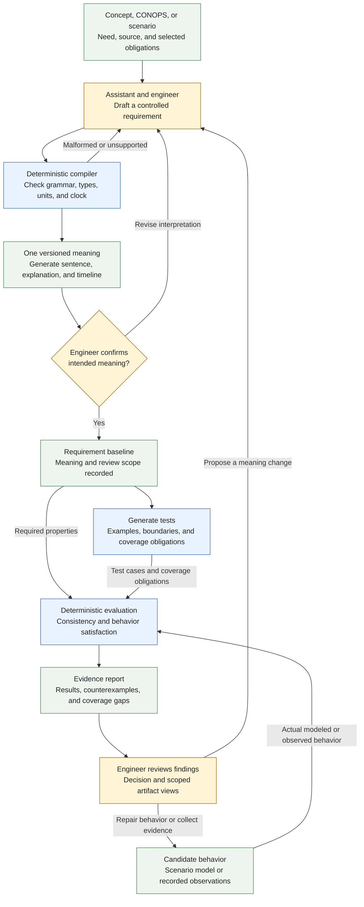

# Computable language and tests: simple plan

Proposed build order. The detailed [language proposal](language-and-tests-proposal.md)
records the broader design. The standalone [profile 1](requirements-language-v1.md)
implements the narrow parser and supplied-trace checks in steps 2, 3, and part
of 6. Generated tests, integrated views, and protected execution remain future
work.

- **1. Select one small example.** Connect a need, a requirement, and an operational scenario. Identify what must be checked and keep assumptions, goals, and unknowns visible.
- **2. Define the first language rules.** Start with **always**, **within**, and **until**. Specify scope, triggers, clock, units, deadlines, and incomplete evidence. Evaluate reuse of a pinned FRET version, retaining attribution and applicable license notices. References: [FRET requirement language](https://github.com/NASA-SW-VnV/fret/blob/master/fret-electron/docs/_media/user-interface/writingReqs.md) and [timing semantics](https://github.com/NASA-SW-VnV/fret/blob/master/fret-electron/docs/_media/user-interface/examples/timing.md).
- **3. Compile each clause into one precise model.** Give it a stable ID and source link. A deterministic parser checks the supported grammar, declarations, types, and units. Unsupported wording remains unresolved.
- **4. Make the meaning reviewable.** Generate the sentence, explanation, and timeline from that model. The engineer resolves consequential interpretations before they become accepted intent. Reference: [FRET trace visualization](https://github.com/NASA-SW-VnV/fret/blob/master/fret-electron/docs/_media/UsingTheSimulator/ltlsim.md).
- **5. Generate meaningful tests.** Produce satisfying, violating, boundary, and incomplete examples; show which conditions each test exercises. Begin with explicitly bounded coverage inspired by FLIP, without claiming full FLIP coverage. References: [FRET test generation](https://github.com/NASA-SW-VnV/fret/blob/master/fret-electron/docs/_media/exports/testgenManual.md) and [Katis, Mavridou, and Pressburger, 2025](https://ntrs.nasa.gov/citations/20250002869).
- **6. Check actual behavior.** Evaluate supplied scenario executions or recorded observations against the requirements. Check consistency separately from behavioral satisfaction. Missing evidence, unsupported checks, or exhausted analysis limits cannot produce a successful required review. Generated examples alone are not implementation evidence.
- **7. Explain results and revise.** Return findings, counterexample timelines, coverage gaps, and exports tied to the exact revision. Repair draft behavior and rerun; route changes to intended meaning back to the engineer. Changing a clause regenerates affected tests and invalidates stale results.
- **8. Prove the complete workflow, then connect all three skills.** Demonstrate a known violation being detected, repaired, and rechecked. Compare equivalent cases with the pinned FRET/backend, then expose the workflow through concept, CONOPS, and scenario skills while keeping each independently usable. First deliverable: one requirement, its explanation and diagram, generated tests, and a reproducible behavior-check report.

The diagram shows the operating flow the plan will build. The language rules
govern compilation, rendering, test generation, and evaluation throughout.

Yellow denotes human/assistant work, blue deterministic programs, and green
artifacts or evidence. Recording an engineer decision in this workflow does not
implement the separate [protected acceptance boundary](protected-runner.md).
