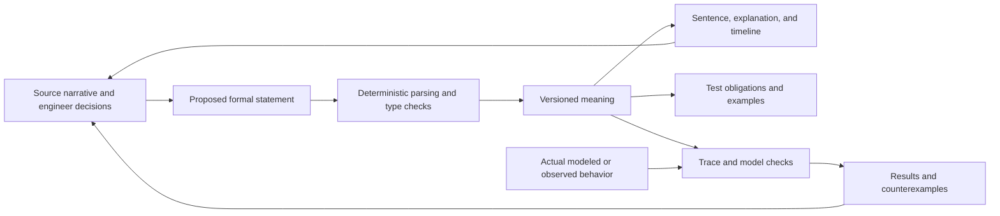

# Computable language and generated tests: proposal

Status: broader design proposal, 2026-09-29. The requested direction is readable language
with deterministic meaning, explanations, diagrams, and responsive test
generation. The grammar and boundary choices below are proposed defaults, not
accepted requirements for a real system. The separate opt-in
[profile 1](requirements-language-v1.md) now implements a narrow grammar and
sampled-trace checker. The generated tests and integrated views below remain
proposals. Nothing here changes the version-1 records or version-2 verifier or
establishes FRET compatibility.

See the [simple plan and systems engineering flow diagram](language-and-tests-plan.md)
for the proposed build order and operating flow.

## One meaning, several views

A formal statement should identify its subject, scope, condition or trigger,
response, timing, typed quantities, and source. Store those fields in one
versioned representation. Generate the controlled sentence, a precise explanation,
a timeline, and check/test obligations from that same representation. Keep the
original narrative linked so the engineer can assess whether the formalization
captures the intended claim.

The assistant may propose a translation or repair. A deterministic compiler
decides whether the controlled language is supported, and programs produce
computable results. Editing a controlled sentence must parse back to the same
representation used by its views; unsupported or ambiguous language remains a
draft. An explanation must not introduce an extra exception or weaker deadline.

Needs, goals, facts, assumptions, observations, and candidate choices retain
their own roles. Formalizing an acquisition calculation, for example, must not
turn a proposed configuration into an accepted SHALL. A document may contain
both formal clauses and qualitative discussion with their status visible.

## A deliberately small first vocabulary

Start with three patterns over the existing bounded, typed predicates. The
sentences below are synthetic examples of a proposed surface language, not
tested FRETish inputs or commands accepted by the current CLI.

| Pattern | Example controlled sentence | Computational question |
|---|---|---|
| Invariant | While mode is active, whenever inhibited is true, Controller shall always satisfy output_enabled = false. | Does every examined state with that scope and condition satisfy the response? |
| Bounded response | While mode is active, upon request becoming true, Controller shall satisfy acknowledged = true within 2 seconds. | Does each qualifying trigger have a matching response by its deadline? |
| Hold until release | While mode is active, upon pending becoming true, Controller shall maintain retained = true until released = true. | Does the held predicate remain true before the release event? |

Use declared identifiers with human-readable labels, Boolean expressions, exact
comparisons, and explicit parentheses. Initially exclude arbitrary nesting of
temporal operators, user-supplied executable code, implicit unit conversion,
and unconstrained prose parsing. Unsupported combinations must be reported.

The first pattern means `scope AND condition IMPLIES response` at each examined
state. The word `always` does not mean an LLM's judgment that the usual path
looks acceptable. Check initial states and reached states, including terminal
states when the scope applies. Keep requirements separate from transition guards:
filtering out violating states with the requirement would conceal the defect.

## Boundary choices that give the words weight

These choices need an explicit language-profile version and tests before use:

- **Observation and clock.** Begin temporal trace checking with a declared fixed
  sampling period and complete rows at each tick. A sampled result covers those
  observations; it does not prove behavior between samples. An untimed scenario
  step has no implied duration. Physical-time checks on an untimed model remain
  unsupported until its timing is supplied. Mapping scenario microsteps to clock
  observations must be explicit and must not silently hide intermediate states.
- **Units.** Declare the clock period and duration units. Normalize permitted
  conversions exactly and record them. For example, a 500 ms clock makes a
  2 second deadline four ticks. Reject a duration that cannot be represented on
  that grid without rounding. Missing clock information cannot yield a timed pass.
- **Condition versus trigger.** `Whenever` evaluates a condition at every
  observation. `Upon` starts an obligation on a false-to-true change while the
  scope applies; the proposed default also treats true at scope entry as a
  trigger. Do not treat these as interchangeable synonyms.
- **Within.** Include the trigger instant and deadline: a trigger at tick 0 with
  a four-tick bound permits a response at ticks 0 through 4. It requires a
  response occurrence, not sustained truth afterward. Each new trigger creates
  its own obligation. One response may discharge overlapping obligations only
  for a declared level-response pattern. Per-request acknowledgments require
  explicit request identity and matching, outside the first Boolean pattern.
- **Scope exit.** The proposed bounded-response and hold patterns stop admitting
  new triggers when scope becomes false but retain obligations already created.
  Cancellation requires an explicit supported rule; scope exit cannot silently
  erase a missed response. This is a proposed choice, not a compatibility claim
  about FRET's scoped timing semantics.
- **Until.** The implemented hold pattern requires the predicate from the trigger
  through the observation immediately before the first release strictly later
  than that trigger. Release already true at the trigger does not erase the
  initial hold obligation. This pattern alone does not require release
  to occur; a separate bounded response can require that. The generated
  explanation must display both facts, because everyday "until" is ambiguous.
- **End of evidence.** A prefix ending before an outstanding deadline or release
  leaves that obligation unresolved. Never turn missing future observations into
  success. An intentionally closed finite review window can establish only the
  corresponding finite claim; closing a file does not cancel pending obligations.
- **Missing values and coverage.** A known violation produces a failure; missing
  values needed for a decision produce unknown. Report whether the condition was
  exercised separately from logical truth. A required demonstration cannot pass
  solely because its trigger never occurred.

An example explanation for the bounded response is: "Every qualifying request
starts a four-tick window on the declared 500 ms clock. Acknowledgment at the
deadline is allowed. Ending observation before that deadline leaves the request
unresolved." Generate the explanation and timeline from the fields, including
scope-entry and cancellation behavior.

## Concrete examples the test generator should produce

For the synthetic bounded-response clause, assume one trigger at tick 0, scope
continuously active, and an explicitly declared clock of 500 ms. These are
proposed expected results, not executed test results.

| Example behavior | Expected finding |
|---|---|
| Response at tick 0 | Pass for this triggered obligation. |
| First response at tick 4 | Pass at the inclusive deadline. |
| First response at tick 5 | Fail at tick 4; show the late response as context. |
| Response absent through tick 4 | Fail; deadline expired. |
| Observation ends at tick 3 without response | Unknown; pending obligation. |
| No trigger anywhere in the review window | Not exercised; required coverage remains incomplete. |
| Scope ends at tick 2, no response through tick 4 | Fail under the proposed retain-pending-obligations rule. |

For an invariant, include an initially violating state, a transition into a
violation, a condition that never becomes true, and cases where one Boolean
term masks another. For hold-until, include premature loss of the held predicate,
release at the trigger, release at a later observation, and an unresolved prefix.

## Small and dynamic test generation

Here, "dynamic" means that the current statement and model determine the tests.
A changed condition, threshold, unit, clock, or deadline regenerates affected
obligations, examples, explanations, and diagrams. It does not allow the assistant
to change the semantics in order to obtain a pass.

Start with deterministic bounded search over small declared domains and horizons:

1. Derive obligations for activation, each predicate's influence, numeric and
   temporal boundaries, scope changes, and incomplete evidence.
2. Find a satisfying example and a nearby violating example where supported.
   Record which change accounts for the difference. Seek short explanatory
   traces with a deterministic tie-breaking order.
3. Distinguish **specification examples**, which illustrate meanings, from
   **model-reachable executions**, which must satisfy the supplied transition
   relation and environmental assumptions. Correlated numeric comparisons cannot
   be independently flipped into an impossible valuation and called an execution.
4. Evaluate actual candidate behavior against the obligation. Generated output
   values are examples or expected values, not measurements of an implementation.
5. Export a readable table/timeline and JSON with requirement ID, semantic
   revision, obligation ID, input/response values, timestamps, expected result,
   actual result when executed, search bounds, and evidence references. A CSV
   export needs accompanying metadata so it cannot lose those bindings.
6. Mark uncovered obligations as unresolved, unsupported, or unreachable within
   the declared search scope. A search cap is unknown, not proof of impossibility.
   Keep the expected coverage set fixed while generating tests; removing a hard
   obligation cannot improve the reported coverage.

FLIP motivates looking for the independent effect of each atomic proposition on
requirement satisfaction. A simple mutation or boundary suite is not automatically
FLIP coverage. Initially report **bounded influence and boundary coverage** with
its own precise denominator. Claim FLIP only after implementing or reusing its
actual obligations for the supported fragment and validating that correspondence.
Generated tests establish neither exhaustive model verification nor completeness
of the source requirements.

Changes should invalidate affected results using actual transitive dependencies.
An initial conservative implementation may rerun all relevant checks. Optimize
incremental work only after tests show that global conflicts and shared definitions
cannot be missed. Measure update latency, installation cost, and engineer review
effort before claiming this is simpler or more dynamic than FRET.

## Responsibilities of the three skills

| Skill | Contribution |
|---|---|
| System concept | Separate needs, candidate choices, calculations, assumptions, and accepted constraints; link formal assessments to their basis. |
| CONOPS | Track overall coverage, external responsibilities, operating modes, and which obligations are formal, qualitative, unsupported, or deferred. |
| Operational scenarios | Supply behavior, exchanges, triggers, outcomes, and exceptions; inspect generated examples and counterexamples with the engineer. |

Each skill remains independently invocable. A shared language and checker can be
optional capabilities with explicit version checks. Installing one skill must not
silently depend on a repository-relative temporal checker being present. Keep the
existing version-1 workflows usable, and keep formalization proposals linked to
their source and engineer decisions. None of the skills authenticates acceptance
or replaces the separate protected-runner milestone.

## Reuse and the next executable increment

Reuse FRET's established distinctions and examine its compiler/test-obligation
implementation before creating equivalent machinery. Compare two small routes:
an adapter to an exact supported FRET subset, and a local evaluator for the three
bounded patterns. A local evaluator is reasonable if its smaller dependencies
have demonstrated value; extending temporal syntax or solver capabilities should
trigger another reuse review. Do not claim compatibility from similar wording.

The first executable increment should have:

- An explicit, versioned contract and one synthetic connected example. No
  reinterpretation of version-1 prose or version-2 requirements in place.
- One representation generating the sentence, explanation, diagram, and
  obligations, with parse/render round-trip checks for supported sentences.
- Direct checking of supplied behavior, including a reachable violation that
  consistency and reachability alone would miss.
- Hand-specified positive, negative, boundary, and incomplete expected results;
  implementation mutations that demonstrate the suite detects wrong behavior.
- Generated examples and exported results for the same requirements. Compare
  with a pinned FRET/backend on the subset where semantics are equivalent;
  explicitly test differences in clock, scope, and end-of-trace treatment.
- Required review blocked by omitted obligations, stale evidence, unsupported
  semantics, and exhausted analysis limits. No general realizability or physical
  validation claim.

## Attribution and source notes

This proposal credits NASA FRET for the structured-language/formal-semantics
workflow and the linked research for requirements-based test generation. No
upstream implementation, figures, private source documents, or user models are
copied here. Preserve upstream license and applicable notices, record the exact
revision and local modifications, and distinguish adaptations when code is reused;
credit alone is not a substitute for the applicable license terms. This project
does not claim NASA endorsement.

Primary sources consulted on 2026-09-29:

- [FRET requirement writing](https://github.com/NASA-SW-VnV/fret/blob/master/fret-electron/docs/_media/user-interface/writingReqs.md),
  [conditions](https://github.com/NASA-SW-VnV/fret/blob/master/fret-electron/docs/_media/user-interface/examples/condition.md),
  and [timing](https://github.com/NASA-SW-VnV/fret/blob/master/fret-electron/docs/_media/user-interface/examples/timing.md).
  The timing guide delegates interpretation of time units to downstream tools.
  Our explicit clock/unit checks are a proposed integration improvement.
- [FRET test-generation manual](https://github.com/NASA-SW-VnV/fret/blob/master/fret-electron/docs/_media/exports/testgenManual.md).
- Andreas Katis, Anastasia Mavridou, and Tom Pressburger,
  [A Streamlined, Formal Approach to Requirements-based Testing](https://ntrs.nasa.gov/api/citations/20250002869/downloads/nfm25_46.pdf),
  2025. Describes extensions of the FLIP criterion and their implementation in
  FRET/CoCoSim. The simplified coverage proposal above is not that implementation.
- [FRET public v3.1.0 release](https://github.com/NASA-SW-VnV/fret/releases/tag/v3.1.0)
  and the [existing local reuse spike](fret-spike.md). The latter was an interface
  inspection, not a successful runtime integration. The living documentation
  links above are not a pinned dependency or a tested compatibility baseline.
