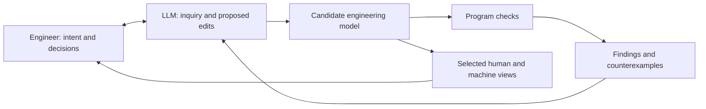

The shared engineering model is the durable representation we maintain. A paragraph, diagram, machine query, or tool export exposes a particular view of that model. No individual view needs to contain everything. The model and each of its views have explicitly declared semantics and scope.

The engineer directs the inquiry and settles consequential choices. The LLM helps elicit needs, investigate uncertainty, propose changes, run programs, and explain findings. Programs supply the verdicts for conditions with defined computational meaning. A narrow question can end with a small model change, an investigation result, or an explicit unknown; producing a complete document is optional.

The diagram describes the proposed workflow. The bundled helpers currently provide structural/completeness checks and limited numeric evaluation. They do not provide general behavioral verification or a protected acceptance service.

Represent needs, functions, actors, requirements, assumptions, decisions, evidence, and their relationships with stable identifiers. Add typed values, units, explicit scope, conditions, and behavioral predicates where the engineering meaning is settled enough to encode. Keep unresolved and qualitative content identifiable without pretending that prose is executable. JSON is the current transport; the underlying types and semantics determine what can be computed. A small language with a defined interpretation is preferable to arbitrary agent-authored executable code as the interchange model.

Retrieve the relevant model slice for an LLM, including needed definitions and dependencies. Use compact changes and targeted diagnostics. Keep full validation outside the context window, including every dependency required by the requested check. Measure total tokens and repair effort on representative tasks before claiming an efficiency improvement; binary storage or shorter keys do not establish a better LLM interface.

A protected harness would need the following responsibilities outside the drafting model's write authority:

| Responsibility | Required behavior |
|---|---|
| Rules and scope | Pin the checker version, rule set, required obligations, and engineer-selected review scope. The candidate cannot delete an obligation from the expected set to obtain a pass. |
| Accepted meanings | Compare changes with an independently held accepted baseline. Relaxing constraints, changing units/definitions, deleting requirements, or narrowing applicability creates an explicit change proposal. Normal draft edits remain inexpensive. |
| Execution | Invoke the trusted checker on a fixed input snapshot, with controlled dependencies and declared analysis limits. Read actual process results; an agent-written success report is not evidence of a run. |
| Results | Bind each result to the artifact, transitive dependencies, rule set, tool version, and scope. The acceptance service reruns checks or verifies a receipt that only the protected runner can issue. An ordinary file hash proves identity, not authority. |
| Incomplete analysis | Preserve failures, unknowns, unsupported expressions, missing evidence, timeouts, and execution errors. None can substitute for a required successful check. Drafting can continue. |
| Coverage | Report which obligations were checked and whether relevant conditions were exercised or reachable. Keep coverage separate from a mathematical result that may be vacuously true. |
| Human decisions and evidence | Obtain consequential decisions through an independently attributable channel. A draft's `accepted` field cannot authenticate assent. Preserve the actual source of observations; model-written evidence labels are not measurements. |
| Revision | Return precise diagnostics, revise affected candidates, and repeat within a defined effort limit. If repair needs a new meaning or unresolved stakeholder choice, return that decision to the engineer. |

These are proposed design requirements, not protections installed by the skill edits. A checker running with the same unrestricted write authority as its authoring agent cannot establish this boundary merely by asking the agent to behave. The design must define and test the actual permission separation. Even then, a correct check establishes its encoded property under its assumptions; it cannot establish that fabricated inputs are true or that the chosen property captures stakeholder intent.

FRET is a candidate backend for supported formal requirement patterns. Existing structural checks would still handle artifact relationships and completeness. Its packaging, semantics, and runtime integration remain to be evaluated before adoption; this revision contains no FRET integration.

Exporters can later map supported parts of the model to SysML, Draw.io, Arcadia/Capella, or Cameo/No Magic formats. Each export should declare its source revision, coverage, and unsupported or lost meaning. An editable human view needs an explicit import/reconciliation path before its edits become part of the checked model. There is no claim of universal or lossless conversion among these tools, and none of these adapters is implemented here.
