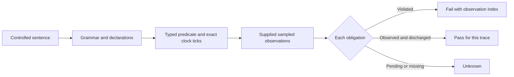

# Controlled requirements language, profile 1

This is an opt-in, small language profile for checking **supplied, finite sampled
traces**. It is inspired by FRETish's component, condition, scope, timing, and
response fields. It is not a FRETish parser or a general temporal-logic engine.
The existing concept, CONOPS, scenario, and finite-verifier records keep their
own contracts. These language semantics are implementation proposals pending
engineer review for each real system.

Run `python3 scripts/requirements.py examples/language/valid.json --review
--manifest examples/language/valid-manifest.json` from the repository root.
Add `--json` for a machine-readable report. The CLI uses Python 3.10+ and the
standard library. The independent manifest fixes the required obligation IDs;
without it, compilation remains a draft check. For new SysML-first work, use
[the SysML profile](sysml-v2-profile.md) instead of maintaining this JSON as a
second source of engineering truth.

For the included bounded-response clause, `request` first becomes true at
observation 1. The 500 ms clock turns its `within 2 seconds` bound into four
ticks, so `acknowledged` may first become true at observations 1 through 5.
The fixture has it true at observation 3. If observation 5 were reached without
acknowledgment, the checker would fail at that deadline; a file ending at
observation 4 would leave the obligation `unknown`.



## Grammar

The parser accepts only the following complete sentence forms; capitalization
of the keywords shown here and punctuation are required:

```text
[In COMPARISON, ]whenever COMPARISON, ACTOR shall always satisfy COMPARISON.
[In COMPARISON, ]upon COMPARISON, ACTOR shall within DURATION TIME_UNIT satisfy COMPARISON.
[In COMPARISON, ]upon COMPARISON, ACTOR shall until COMPARISON satisfy COMPARISON.
```

`whenever` or `upon` begins with a capital letter if there is no `In` clause.
`COMPARISON` is `PROPERTY OP VALUE [UNIT]`. A property is a simple identifier
or one subject-qualified path such as `unit.request`. Operators are `=`, `!=`, `<`,
`<=`, `>`, `>=`. Ordered comparisons require a declared integer property.
`VALUE` is `true` or `false` for a Boolean, one declared label for an enum,
or an exact signed decimal number for a bounded integer quantity. Integers in the
record are ticks of their declared `scale`; a sentence's physical decimal is
converted to those ticks exactly. A quantity's unit must equal the property's
declared unit. Dimensionless quantities omit the unit. No implicit quantity-unit
conversion or floating-point equality is used.

`TIME_UNIT` is `milliseconds`, `seconds`, or `minutes` (with the singular
spelling also allowed). A positive decimal duration must be an exact multiple
of the declared clock period after conversion to milliseconds. For example,
two seconds on a 500 millisecond clock is exactly four observations. The clock
period itself must be positive and exactly representable in milliseconds.
Unknown names, malformed clauses, unsupported combinations, extra words, bad
types, and incompatible units are errors; they cannot become a successful
required review. Expressions with `and`/`or`, arbitrary temporal nesting, and
free-form quoted prose are outside this profile.

## Model and input contract

The input JSON has `language_version: 1`, a `clock` object with `period` as a
positive decimal string and `unit` as above, an `actors` map, a `properties`
map, and a `requirements` map from stable IDs to controlled sentences. Its
property declarations follow the version-2 verifier's `bool`, `enum`, and
bounded `int` types, with `owner` set to `input` or `controlled`. A sentence's
actor must be declared and its response must name a controlled property.
`controlled` denotes control within this file's system boundary; this profile
does not independently verify allocation of a property to a particular actor.
Property names and enum labels are case-sensitive identifiers. Each
requirement must have a distinct stable ID. The optional `observations` array
contains successive property-value maps sampled on the declared clock. Trace
values for integer properties use the declared integer ticks, just as version
2 does. A trace includes `complete: true` only when its declared observation
window is complete; this label describes the supplied file, not authenticated
evidence of a physical run.

Use a separate file for source passages, review decisions, or measurements.
The input's assertions remain candidate statements. This profile does not
convert a source document into accepted engineering intent.

## Trace meaning

Observation 0 is the initial sampled state. Every later observation is one
clock tick after its predecessor. The checker reads values as post-transition
samples; events between samples are outside the result. It evaluates every
listed state, including the initial and final state.

An optional `In` comparison limits **new** checks and triggers to observations
where the scope holds. A missing `In` clause means all observations. For an
`upon` condition, an event occurs on false-to-true change while scope holds;
a true condition at the first observation or at scope entry also triggers.
`Whenever` evaluates its condition independently at every scoped observation.
Unknown readings needed by a requirement make that requirement's trace result
unknown when that missing value could change the finding. A missing earlier
response sample does not invalidate a known response within the deadline; a
missing trigger outside a known-false scope is irrelevant. A fully observed,
known violation still fails its requirement.

- **Always:** At every observation where scope and condition hold, the
  response must hold at that same observation. No exercised condition means
  `unknown` in a required demonstration; it is not a useful coverage pass.
- **Within:** Each trigger creates an obligation. A response at the trigger
  observation or any observation through the inclusive deadline discharges
  it. A response after the deadline is late. This first profile treats the
  response as a Boolean level or typed predicate: one matching observation
  can discharge overlapping obligations. It cannot match distinct request
  IDs or prove that a receipt is durable.
- **Until:** Each trigger requires the response at the trigger and at each
  later observation **strictly before** the first release observation that is
  strictly later than the trigger. A release already true at the trigger does
  not erase the hold obligation. This clause does not
  require release to occur. An observed prefix with no release remains
  `unknown`; a separate deadline requirement can require release.

Scope exit stops new triggers but does not cancel an existing `within` or
`until` obligation. A file ending before an outstanding deadline or release
does not silently complete it. A known failure returns `fail`; an unresolved
obligation or incomplete trace returns `unknown`. Results are for the supplied
finite observations, not a proof of all possible or continuous behavior.

The report's `claim_scope` distinguishes draft grammar/type compilation,
candidate-scope trace checking, and required trace checking with an external
manifest. It identifies the artifact hash,
compiler version, checked requirement
IDs, exact clock and normalized deadlines, each status, an observation
index for a known counterexample, and pending indices where determinable.
Compilation alone is a draft grammar/type check; CLI `--review` requires a
manifest, supplied observations, complete coverage of every expected
requirement, and no failing or unknown result. The monitor uses linear work in
the supplied trace, has an explicit work cap, and bounds pending examples in
the report while retaining their count. An omitted source requirement outside
the manifest is still not discovered by this checker; source-to-manifest
coverage requires a separately governed inventory.

## Relation to established work

FRETish supplies the field structure and the important distinction between
regular (`upon`) and holding (`whenever`) conditions. Our limited grammar and
finite-trace defaults are specified here explicitly and should be compared
with a pinned FRET version before any equivalence claim. FRET's timing guide
delegates time-unit interpretation to downstream analysis tools; this profile
checks clock units and exact conversion itself. No FRET source code is copied.
FRET can treat a scope ending before a deadline as satisfaction; this profile
retains the pending obligation and returns `unknown` until the deadline is
observed or a matching response occurs. This is an intentional difference.

- [FRET requirement writing](https://github.com/NASA-SW-VnV/fret/blob/master/fret-electron/docs/_media/user-interface/writingReqs.md)
- [FRET condition semantics](https://github.com/NASA-SW-VnV/fret/blob/master/fret-electron/docs/_media/user-interface/examples/condition.md)
- [FRET timing semantics](https://github.com/NASA-SW-VnV/fret/blob/master/fret-electron/docs/_media/user-interface/examples/timing.md)
- [FRET scope semantics](https://github.com/NASA-SW-VnV/fret/blob/master/fret-electron/docs/_media/user-interface/examples/scope.md)
- [FRETish formal semantics paper](https://lauratitolo.github.io/publication/2022cpp/2022CPP.pdf)
- [Runtime verification of finite prefixes](https://pspace.org/a/publications/tosem-rv.pdf)
- [FRET finite-trace visualization](https://github.com/NASA-SW-VnV/fret/blob/master/fret-electron/docs/_media/UsingTheSimulator/ltlsim.md)
