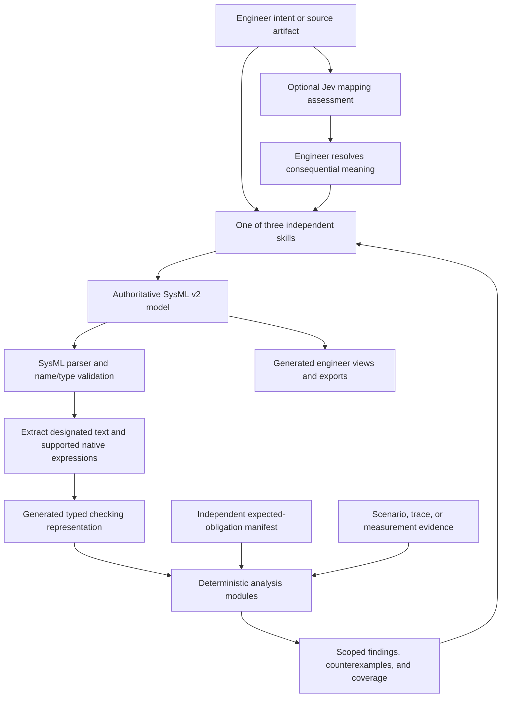

# Implementation plan: SysML v2 model first

**Status: implementation in progress, 2026-09-29.** The local alpha now uses the
pinned pilot parser, three model-first skill templates, a bounded sampled
requirement checker, exact correlated events, a bounded quantity subset,
cross-file parsing, parsed context/diff views, and an independent review manifest. The acceptance gates
below describe the full target; they are not all complete. See the
[implemented profile](sysml-v2-profile.md) for the exact running scope.
This plan supersedes
the primary-artifact choice in [the earlier architecture proposal](v2-architecture-proposal.md):
**all three skills will default to SysML v2 textual models as the authoritative
system model**. Internal JSON will be a generated compiler artifact, not another
engineering model to maintain.

The engineer retains authority over intent, obligations, applicability, units,
thresholds, and selection. The model may contain broad concept, CONOPS, and
scenario knowledge even when only part has computational semantics. A valid
SysML model and a successfully checked engineering obligation are separate claims.

## Representation and text authority

Use ordinary SysML packages, parts, attributes, interfaces, requirements,
constraints, actions, states, cases, and relationships. Keep needs, goals,
qualitative assessments, and unresolved questions distinguishable from mandatory
requirements. Each skill authors the elements relevant to its task in one
system-wide namespace; standalone invocation creates a minimal package with
explicit imports.

The target computation profile recognizes **named documentation blocks**
inside model elements:

- `doc cse` with header `CSE-REQ/2.0`, owned by an assumed or required
  constraint, contains a controlled requirement clause.
- `doc cse` with header `CSE-OPS/2.0`, owned by an action or state element,
  contains supported operational assertions. Its grammar must explicitly declare
  guards, effects, exchanges, or order; narrative alone supplies none of them.
- Other documentation remains narrative. A misspelled marker, unknown profile,
  or ordinary prose attached to an expected computable obligation cannot
  disappear from review or count as checked.

These are **project conventions inside standard SysML documentation**, not new
SysML keywords. OMG describes documentation and requirement constraints in
sections 7.4.2 and 7.21; documentation alone is informal. The pilot grammar
explicitly permits named documentation. Our compiler supplies semantics only to
the designated controlled text. Other SysML tools can preserve and display it
without necessarily executing it.
[OMG language specification](https://www.omg.org/spec/SysML/2.0/Language/PDF),
[pilot grammar](https://github.com/Systems-Modeling/SysML-v2-Pilot-Implementation/blob/master/org.omg.sysml.xtext/src/org/omg/sysml/xtext/SysML.xtext).

There is one authoritative representation per constraint. For supported native
SysML constraint expressions, the expression is authoritative and readable
documentation is generated from it. For a controlled-text constraint, its
designated text is authoritative and the compiler generates its checking form.
Reject an independent native expression and controlled clause on the same
constraint until a tested equivalence check exists. Neither ordinary prose nor
a `satisfy` relationship establishes observed satisfaction.

Bind clause names through the parsed SysML namespace and subject parameters,
then retain resolved element identities and source ranges. Do not use fuzzy
matching or let Jev resolve a missing declaration. Use stable short IDs on
reviewed elements, with a project-unique identity registry; qualified names aid
resolution but renaming cannot silently create a new obligation. Parameterized
definitions require explicit bindings before evaluating a concrete instance.

Use declared SysML quantity types and unit references. Convert only supported
units with exact decimal/rational arithmetic; record clock origin, time base,
sampling, and observation completeness explicitly. Unknown conversions or
unbounded domains remain unsupported. A versioned CSE metadata library will
attach source IDs, source revisions/locators, category, and profile information
using standard metadata; its syntax is a phase-1 parser fixture, not an assumed
extension. Source IDs resolve to a separate inventory rather than embedding raw
documents. Record adopted library revisions.
[OMG model libraries and schemas](https://www.omg.org/spec/SysML/2.0),
[upstream metadata example](https://github.com/Systems-Modeling/SysML-v2-Release/blob/master/sysml/src/examples/Metadata%20Examples/RequirementMetadataExample.sysml).

## End-to-end target



Illustrative synthetic authoring target:

```sysml
package AckExample {
    private import ScalarValues::Boolean;

    part def Controller {
        attribute request : Boolean;
        attribute acknowledged : Boolean;
    }
    part controller : Controller;

    requirement <R_ACK> TimelyAcknowledgment {
        subject unit = controller;
        require constraint responseTime {
            doc cse /*
            CSE-REQ/2.0
            Upon unit.request = true, unit shall within 2 seconds
            satisfy unit.acknowledged = true.
            */
        }
    }
}
```

The outer constructs, controlled block, feature-path support, and line-wrapping
rule have now been exercised with the pinned pilot parser and the local checker
in the [synthetic fixture](../examples/sysml/ack.sysml). This does not validate
unimplemented profile features.

The fixture will link `R_ACK/responseTime` to synthetic source `SYN-01`, bind
trace columns to the two resolved attributes, and declare a complete one-second
sample clock. If request rises at 1 s and acknowledgment first holds at 3 s,
the inclusive two-second instance passes. A complete trace through 3 s with no
acknowledgment fails at that deadline; one ending at 2 s is pending/unknown.
This first example concerns a Boolean signal, not correlated transactions.
The [correlated-event fixture](../examples/sysml/correlated-events.sysml) adds
request IDs; acknowledgment B does not discharge A.
The report identifies the model revision, clause, evidence window, and claim.
No LLM call is required to repeat either check.

## Phased work and acceptance gates

| Phase | Deliverable | Gate before promotion |
|---|---|---|
| **0. Stabilize current verdicts** | Repair work/report limits, independent expected scope, compile-versus-trace wording, missing-data dependencies, and parser round trips from the [readiness review](language-readiness-review.md). Preserve known failures when evidence is truncated. | Existing regressions plus independent edge-case oracles pass; deleting a failed expected clause, ending evidence early, or exhausting a budget cannot yield review success. |
| **1. Establish the SysML contract and parser** | Add a small headless adapter around the upstream Xtext/EMF parser and validators; resolve imports and export only the AST information our Python checker needs. Define the CSE documentation/metadata conventions, native-expression subset, identity rules, and precise category mappings for all skills. | Validate the example, metadata, cross-file references, units, and invalid variants with the actual parser. Pin implementation, standard libraries, spec revision, build/runtime dependencies, and licenses. Publish a support matrix and reproducible local invocation. |
| **2. Connect model to computation** | Extract controlled clauses from parsed owners; resolve names/subjects/units; compile to the existing predicates and temporal monitors. Add the separate review manifest, evidence bindings, compact findings, and deterministic rendering. Native expressions initially support only explicitly listed Boolean/comparison forms. | Same supported clause inside SysML and in the existing checker yields the same expected result. Unknown text, hidden/removed requirements, incompatible bindings, stale evidence, and ambiguous authority fail visibly. Parse/render/parse preserves reviewed meaning. |
| **3. Make all three skills model first** | Update skill instructions, record contracts, templates, views, diff/impact behavior, and installation instructions. Add explicit v1-to-SysML migration with retained IDs, provenance, and a loss/unresolved report. | Each skill independently creates and revises a valid model; their models compose through imports without duplicate identities. Existing v1 records/helpers still work. CONOPS/scenario shared helper copies and contracts remain aligned. No migrated prose gains guards, effects, thresholds, or acceptance by inference. |
| **4. Expand analysis across system behavior** | Add timestamped and correlated events, overlapping obligations, event order, state/mode transitions, typed payloads, finite quantification, exact budgets, and dependency-based incremental checks. Add each capability with a separate semantic contract. | Public/synthetic acceptance cases cover nominal, off-normal, lifecycle, boundary, missing-data, and resource-limit behavior. Full and focused analyses agree on the same obligations. Unsupported relevant SysML behavior remains in coverage. |
| **5. Integrate deeper NASA analysis and optional Jev** | Introduce pinned FRET formalization, then supported realizability/test-generation adapters; evaluate Jev/OpenRouter on source mappings. Runtime-monitor exports are a later supported capability. | Translation parity holds for the declared fragment; solver failures/timeouts cannot pass. Jev adds measurable value on held-out public examples without supplying verdicts or approving meaning. |

Current gate assessment: phase 0 has the independent short-trace oracle and
resource limits, but its full report/coverage contract still needs review;
phase 1 has the real pinned parser, library, imports across supplied files,
source locations, short-ID uniqueness, and a documented profile, but no native
unit-reference or metadata-library support; phase 2 runs Boolean, bounded
quantity, and correlated-event clauses against bound evidence, but native
expression evaluation and general round-trip/export checks remain; phase 3 has
model-first skill guidance, templates, a parsed short-ID context view, and a
conservative structural/documentation diff, but no automated V1 migration or
full generated engineering views; phase 4 has correlated events and exact deadlines,
but no state/mode engine in SysML. A bounded synthetic variable-influence
generator now provides an early phase-5 test artifact; pinned FRET formalization,
formal FLIP coverage, realizability, and Jev evaluation remain unimplemented.

**Parser choice:** use the upstream pilot implementation, not a new regex SysML
parser. Start the compatibility spike with the
[2025-09 release](https://github.com/Systems-Modeling/SysML-v2-Pilot-Implementation/releases/tag/2025-09)
and matching libraries; freeze its full commit only after the phase-1 tests.
Target formal SysML 2.0, with its March 2026 editorial specification. Do not
silently adopt `latest`: the
[2026-07 pilot release](https://github.com/Systems-Modeling/SysML-v2-Pilot-Implementation/releases/tag/2026-07)
targets SysML 2.1 Beta 2. The headless adapter and its dependency cost still need
demonstration; a desktop/server installation is not assumed necessary for every
check. Keep build/download data on the verified `/workspace`.

Migration retains the distinction between an engineering record and an
executable model. V1 concept assessments should become documented assessments;
V1 operational exchanges should become modeled/documented exchanges. Generating
an executable interpretation is a separate proposed change. New recorded work
now defaults to SysML in the three skills as an alpha, while existing V1 files
remain on their original contracts. An automated V1 migration and loss report
are still missing, so the phase-3 promotion gate is not complete.

## Correctness and coverage contract

The independent review manifest lists expected source obligations, selected
model/constraint IDs, required analysis types, and unresolved/unsupported items.
Cross-check both directions: missing expected clauses and new or unclassified
normative clauses require disposition. Include applicable inherited constraints,
assumptions, and dependency closure. A candidate cannot select its own complete
review denominator. Local separation catches omissions; it is not authenticated
acceptance or a protected execution boundary.

| Diagnostic class | Result meaning |
|---|---|
| SysML syntax, import, name/type validation | Invalid model; behavior has not been checked |
| CSE grammar, version, identity, source/binding, or authority error | Clause cannot be compiled or traced reliably |
| Unsupported valid construct/operator/unit mapping | Legal model content with no supported computation |
| Coverage gap, unavailable observation, or unfinished obligation | Required review incomplete or result unknown |
| Constraint conflict, deadline violation, unreachable required behavior | Failure with the relevant clause IDs and witness |
| Budget exhaustion or backend timeout | Analysis incomplete; preserve already established failures |
| Parser/backend crash, malformed response, or stale artifact | Error; never reuse it as success |

Retain explicit `pass`, `fail`, `unknown`, `unsupported`, `not_run`, and
`error` statuses. Report syntax, trace satisfaction, model exploration,
consistency, realizability, source coverage, and engineer acceptance separately.
No trigger exercised is a coverage fact, not evidence of the intended response.
Draft checking can proceed before acceptance; a required baseline review binds
the accepted model and scope revisions.

Keep AST source locations and patch the original SysML files; do not regenerate
unrecognized portions from a reduced checking representation. Round-trip tests
compare resolved identities, predicates, units, bindings, provenance, and
narrative preservation. Reparse every generated SysML export with pinned
libraries. A lossy destination must emit a loss report; it cannot silently
replace the authoritative model. Parser acceptance supports a specific
validation claim, not certification of the checker as a full SysML tool.

## FRET, tests, and evaluation

Reuse FRET through an adapter for an explicitly mapped fragment. Its
[CLI](https://github.com/NASA-SW-VnV/fret/blob/master/fret-electron/docs/_media/cli/cli.md)
offers temporal formalization; its
[timing guide](https://github.com/NASA-SW-VnV/fret/blob/master/fret-electron/docs/_media/user-interface/examples/timing.md)
requires us to handle unit conversion. Preserve our explicit finite-trace
pending policy: FRET's finite-formula early-end behavior is not automatically
equivalent. Specify condition edges, scope entry/exit, overlapping triggers,
and end-of-trace truth tables before differential testing. Until parity is
demonstrated, call our language FRET-inspired. Later
[realizability](https://github.com/NASA-SW-VnV/fret/blob/master/fret-electron/docs/_media/exports/realizabilityManual.md)
and [FLIP test generation](https://github.com/NASA-SW-VnV/fret/blob/master/fret-electron/docs/_media/exports/testgenManual.md)
retain their own claims and pinned solver compatibility.

The local [variable-influence generator](variable-influence-tests.md) is a
precursor, not an implementation of FLIP: it finds concrete one-property,
one-sample pass/fail pairs for selected sampled clauses, with explicit search
limits. It cannot infer that an uncovered variable is redundant, establish
system feasibility, or replace supplied behavior evidence.

Use synthetic fixtures and the attributed public derivatives already described
in [public-language-evaluation.md](public-language-evaluation.md). Include
deadline-before/at/after cases, nested scopes, imports/redefinitions, unit
mismatch, wrong request ID, duplicate events, relevant/irrelevant missing data,
cycles and valid waits, false assumptions, and round-trip loss. Use an
independently written short-trace oracle and targeted mutation cases; generated
tests from the same compiler alone cannot validate its semantics. Run
`python3 scripts/check.py` after implementation changes and add actual parser
and backend integration checks at their phase gates.

Jev remains optional source-to-model advice through the
[OpenRouter Decisions API](https://openrouter.ai/docs/guides/community/jev).
Version its questions, record the resolved model/provider and answer, support
replay, and compare against the same workflow without Jev. It never performs
arithmetic, narrows required scope, or supplies a deterministic verdict.

Measure total model tokens for matched tasks under the actual target tokenizer
or API usage: initial instructions/examples, model slices, output, repairs, and
Jev calls. Also measure accepted semantic coverage, engineer corrections,
latency, and cost. Include a prose-then-extraction baseline. The existing
[context probe](context-measurement.md) is only a word/punctuation proxy;
neither SysML familiarity nor token savings has yet been established.

## Delivery boundary and remaining choices

The current local alpha has parser-validated SysML output and honest
supported-scope results. Broad model content need not await broad executable
semantics. Native constraint evaluation, a CSE-OPS state/transition profile,
formal FRET parity, realizability, FLIP test generation, hosted Jev evaluation,
and a protected runner remain unimplemented.
Private models, raw documents, credentials, and annotations stay out of Git.
No private material is sent to Jev/OpenRouter merely by adopting SysML or
enabling local checking; a hosted trial needs its own authorized data scope.

The engineer reviews consequential semantic choices through concrete fixtures:
scope-exit obligations, request-correlation policy, environmental assumptions,
and units/thresholds. Routine parser packaging and draft repairs proceed
within implementation scope. Outstanding technical choices are the validated
pilot commit/library pairing, the minimal CSE metadata definitions, and the
first native-expression subset. Phase 1 resolves these rather than leaving
them as implicit assumptions. A separate protected-runner milestone is required
before claiming resistance to agent edits, forged results, or unauthenticated
acceptance; hashes alone do not provide that boundary.
