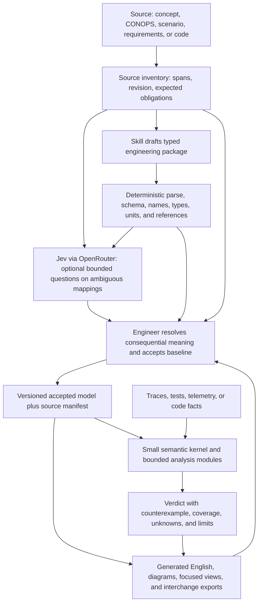

# Version 2 architecture proposal: model first, compute from it

**Status (2026-09-29):** Design proposal, not an implemented or validated verifier. The existing finite verifier and controlled-requirements checker remain separate alpha capabilities. This proposal keeps the three skills independently invocable and leaves engineering decisions with the engineer.

## Recommendation

Have each skill produce a **versioned typed engineering package** as its primary durable artifact. It contains stable IDs, source locators, declared entities and units, needs, goals, requirements, operational states, events, scenario steps, trace links, assumptions, and explicit unresolved meanings. The package is a small, documented subset of a general systems model, not an unrestricted new natural language. Render English, diagrams, focused LLM views, FRETish-like requirement views, and supported SysML v2 exports **from** that same package. The engineer reviews the rendered meaning and accepts the baseline; a checker computes only over accepted, supported semantics.

This reverses the current expensive loop of repeatedly reading long prose and translating it into checkable data. It does **not** establish that machine notation always uses fewer model tokens than English. The savings hypothesis is that stable IDs, incremental slices, and computed diagnostics reduce repeated context and repair turns. Measure that on the same engineering tasks using the actual target model tokenizer and count all tokens, including initial authoring, corrections, Jev calls, and reviewer rework. The existing [context probe](context-measurement.md) used a word/punctuation proxy, not billed LLM tokens.

The source inventory is independent of the drafted package: deleting a difficult clause cannot silently shrink the denominator for a required review. Code can be a source artifact; parse it with language-specific tooling to obtain syntactic facts and exact source locations. Code structure does not, by itself, declare the system's intended requirement or prove operational behavior. Generated models retain provenance and unresolved assumptions. Jev's answer is review evidence, never a computed systems verdict.

## Language choice

| Candidate | Fit | Version 2 role |
|---|---|---|
| [OMG SysML v2](https://www.omg.org/sysml/sysmlv2/) | General systems language for requirements, structure, behavior, verification, and traceability; textual and graphical forms with a standard API | Best-established **external systems model language**. Import/export a tested subset; do not claim conformance to all SysML v2 or make its whole grammar the small runtime kernel. |
| [NASA FRETish](https://github.com/NASA-SW-VnV/fret/blob/master/fret-electron/docs/_media/user-interface/writingReqs.md) | Restricted English for timed requirements with formal semantics | Adopt its scope/condition/timing discipline and, where beneficial, call a pinned FRET integration or emit an explicitly mapped subset. Keep attribution and equivalence tests. |
| [AADL / OSATE](https://osate.org/about-osate.html) | Architecture and analysis for embedded and real-time computing systems | Useful adapter for that domain; too specialized as the sole concept/CONOPS language. |
| [OMG ReqIF](https://www.omg.org/reqif/) | Requirements exchange between tools | Interchange adapter, not a behavioral execution language. |
| [HL7 FHIR](https://hl7.org/fhir/R4/overview-arch.html) | Healthcare information resources and exchange | Relevant only for health-system data interfaces; not a general systems engineering authoring language. |
| Typed package (versioned schema) | Narrow semantics under our control | Canonical internal representation. A compact text view can be generated for model prompts; a lossless machine representation is retained for checking. |

No primary source establishes that today's LLMs reliably author SysML v2, or that SysML v2 text is more token-efficient than equivalent English. Treat both as experiments, not assumptions. A fair trial gives a model the same source and asks it to produce (a) prose plus later extraction, (b) a supported SysML v2 subset, and (c) the supported typed package. Score source fidelity, accepted semantic coverage, grammar/type success, total tokens, human correction time, and successful verification. A concise syntax that drops scope, units, exceptions, or provenance fails the task even if it is cheap. The useful FHIR analogy is typed resources, identities, references, profiles, and conformance checks; its healthcare resource types are not the right general engineering vocabulary.

## Computation engine: wide coverage through small modules

Keep one strict parser and typed core. Add bounded modules in this order, with explicit coverage and `unknown` for missing or unsupported semantics:

1. **Repair the current review boundary:** work and report budgets, independent expected-obligation manifest, clear compile-versus-behavior status, missing-evidence semantics, and parser round trips. These are documented in the [Astra readiness review](language-readiness-review.md).
2. **Event and clock semantics:** event identity and correlation, timestamps with declared time bases and units, rising/falling edges, scope entry/exit, overlapping instances, deadlines, `until`, and incomplete traces. Give every temporal operator an explicit end-of-trace rule and counterexample.
3. **System behavior:** typed state machines, exchanges with payload identity, guards/effects, ordering, bounded quantities and arithmetic, dimensional checks, environment assumptions, and assume/guarantee contracts. Analyze bounded state spaces and report limits.
4. **Stronger formal analysis:** require satisfiability and contradiction checks; offer solver-backed realizability for the claim “a controller strategy can satisfy these obligations for all allowed environment behavior,” with pinned solver, translation tests, timeout/unknown, and a small independent oracle. The current finite consistency check does not establish realizability.
5. **Requirement-based tests and monitors:** generate counterexample-oriented and requirement coverage tests, inspect/edit/export traces, measure which obligations and temporal boundary cases were exercised, and consider FRET's FLIP criterion where an exact mapping is validated. Export runtime monitors only for a proven supported fragment.

This follows capabilities already demonstrated by [FRET's semantic explanations and formalizations](https://github.com/NASA-SW-VnV/fret/blob/master/fret-electron/docs/_media/semantics/semanticsOverview.md), [realizability analysis](https://github.com/NASA-SW-VnV/fret/blob/master/fret-electron/docs/_media/exports/realizabilityManual.md), [test generation](https://github.com/NASA-SW-VnV/fret), and [FRET-to-Ogma-to-Copilot monitoring](https://github.com/NASA-SW-VnV/fret/blob/master/fret-electron/docs/_media/ExportingForAnalysis/copilot.md). FRET 3.1 also added [R2U2 monitor export](https://github.com/NASA-SW-VnV/fret/releases). These tools do not automatically check this project's source coverage, declarations, trace IDs, or acceptance boundary. A FRET adapter needs exact semantic mapping, especially time units and finite-trace endings; an upstream output cannot be silently treated as equivalent. FRET reports Apache-2.0 licensing; preserve license and notices if code is reused.

## Where Jev fits through OpenRouter

Use Jev only when a source-to-model relation is genuinely ambiguous: classify a source span as requirement/goal/assumption/other; choose among **quoted** candidate trigger or response spans plus `none`; flag a possible unsupported leap from text to clause; route borderline cases to engineer review. Ask bounded typed questions over short source slices and draft clauses. Do not ask it to compute elapsed time, compare thresholds, infer missing IDs, or certify satisfaction. Reuse a recorded answer for a given source revision, question version, and model revision; log the exact returned probabilities and route. Failure or uncertainty leaves the mapping unresolved.

The documented OpenRouter route is `POST https://openrouter.ai/api/alpha/decisions`, or `openrouter.alpha.decisions.create()`, with model `typesafe/jev-1.13`, `state`, and typed `questions`. This is distinct from chat completions. Pin the requested model and record the resolved model/provider because aliases and hosted behavior can move. The endpoint is currently labeled **alpha**; wrap it behind an optional adapter and keep recorded-answer replay. [OpenRouter tutorial](https://openrouter.ai/blog/tutorials/how-to-use-jev/), [model page](https://openrouter.ai/typesafe/jev-1.13/), [TypeSafe limitations](https://docs.typesafe.ai/model-jaggedness/jev-1.13). No live OpenRouter call or private source transmission has been performed for this proposal.

## Worked engineering example

Suppose the source says: “For each fire alarm, close its isolation valve within five seconds.” The skill drafts an event-linked obligation with an alarm ID, valve ID, five-second duration, clock definition, and exact source span. The engineer resolves whether “close” means command issued or closed position observed, which is a consequential distinction. The canonical model then drives the readable shall-statement and the temporal check.

If alarm `A7` is observed at 12 s and its matching valve-closed event at 16 s, that instance passes the five-second bound. If closure occurs at 18 s, it fails with the two event locations and a 6 s elapsed-time counterexample. If the log ends at 14 s, it is pending/unknown under an explicitly declared incomplete-trace policy; it must not become a success. An unmatched closure for another alarm cannot satisfy `A7`. A generated test can probe exactly-on-deadline, late, missing, duplicate, and cross-ID closure. Jev might flag that the draft used “commanded” instead of “observed”; it cannot calculate or decide the timed verdict.

## Delivery sequence and evidence gate

1. Fix the current alpha review issues and freeze a small, versioned schema with a source manifest and generated English. Keep existing v1 records available and avoid implicit conversion from prose.
2. Implement event identity, timestamps, and temporal instances, then test public synthetic derivatives and the engineer's accepted slice with independent trace oracles, boundary cases, and work limits.
3. Prototype SysML v2 subset interchange and FRET formalization as **separate adapters**. Round-trip supported examples and publish unsupported/lossy elements; only promote an adapter after equivalence tests against its documented semantics.
4. Run a labeled, recorded Jev/OpenRouter evaluation on public or approved material. Compare with a no-Jev baseline for omissions, invented thresholds, engineer review load, total tokens, cost, and latency. Do not put Jev in every checking path by default.
5. Add solver-backed realizability, test generation/coverage, and monitor export incrementally; each module must state its proof scope, input assumptions, timeout behavior, and validation fixtures before a required review can rely on it.

The acceptance target is **language with weight**: each accepted obligation has a source, explicit variables and units, a precisely described claim, a declared observation boundary, and a computable result or an honest reason the result is unknown. A model hash identifies what was checked; it does not authenticate an engineer decision or establish a protected runner.
